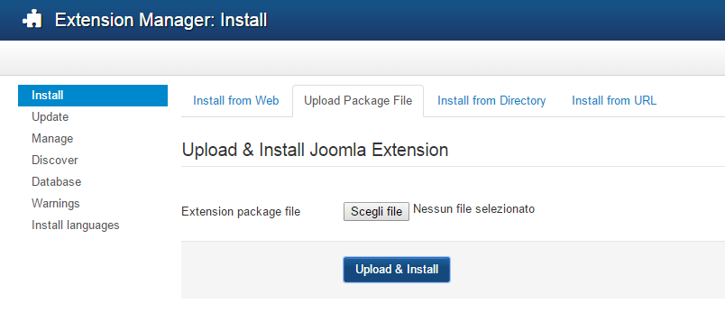

## Installation

Once you've downloaded the zip file from github, you're ready to upload it to your Joomla extensions page and install the plugin.

First, visit the Upload Package File tab from your *Joomla Extension Manager*, and select the **Upload & Install** button shown in the screenshot below:

## Create Facebook App

Go to [https://developers.facebook.com/apps](https://developers.facebook.com/apps) register and Add a New App for website, choose a name for your App, and add you domain to settings.

### Rsvp Events

If you want to enable rsvp buttons in your website you have to add Item (rsvp_events) in Review of your Facebook App and wait for approval.

## Settings

For each field if you hover the mouse pointer on the relative label, you can see a tooltip with a description.

### Basic

In the basic settings you can see:

* You have to copy AppId and Secret Key from your Facebook App;

* Facebook Page Id is the page ID or profile ID, you can get it by simply change www with graph on your page/profile url, for example [www.facebook.com/p2warticles](http://www.facebook.com/p2warticles) will be [graph.facebook.com/p2warticles](http://graph.facebook.com/p2warticles);

* Show events allow you to select which events to show

* You can enable microdata for new Events or all events, but for Google is better only new.

### Advanced

Advanced options will come with an easy and intuitive settings with accordions sections. Each field have a tooltip description, you can see it by hover the label with the pointer, how you can in the following image:

## Shortcodes

All these params will override plugin settings and are case sensitive.

<table>
  <tr>
    <td>Params for Fb General Settings</td>
    <td>Value</td>
    <td>Description</td>
    <td>Possible values</td>
  </tr>
  <tr>
    <td>fbUserName</td>
    <td>number</td>
    <td>Facebook page/profile username or id</td>
    <td>∞</td>
  </tr>
  <tr>
    <td>showEvents</td>
    <td>string</td>
    <td>New: only actual and future events; Past: past events</td>
    <td>new, past, all</td>
  </tr>
  <tr>
    <td>limitEvents</td>
    <td>number</td>
    <td>Number of Events to show</td>
    <td>∞</td>
  </tr>
  <tr>
    <td>orderEvents</td>
    <td>string</td>
    <td>Order</td>
    <td>ASC, DESC</td>
  </tr>
  <tr>
    <td>enableMicrodata</td>
    <td>string</td>
    <td>Add microdata for SEO, for Google best option is New</td>
    <td>false, all, new</td>
  </tr>
</table>

<table>
  <tr>
    <td>Params for Fields</td>
    <td></td>
    <td></td>
    <td></td>
  </tr>
  <tr>
    <td>showFields</td>
    <td>array</td>
    <td>Fields to select and order</td>
    <td>title, image, date, description, ticket_uri, venue, rsvp, link, update_time, attendants</td>
  </tr>
</table>

<table>
  <tr>
    <td>Params for Title</td>
    <td></td>
    <td></td>
    <td></td>
  </tr>
  <tr>
    <td>linkedTitle</td>
    <td>boolean</td>
    <td>Add link to title</td>
    <td>true, false</td>
  </tr>
  <tr>
    <td>titleTag</td>
    <td>string</td>
    <td>Choose a tag for event title </td>
    <td>h1, h2, h3, p, div</td>
  </tr>
  <tr>
    <td>titleClass</td>
    <td>string</td>
    <td>Choose a css class name</td>
    <td>∞</td>
  </tr>
</table>

<table>
  <tr>
    <td>Params for Picture</td>
    <td></td>
    <td></td>
    <td></td>
  </tr>
  <tr>
    <td>pic</td>
    <td>string</td>
    <td>You can use this to get a pre-specified size of picture.</td>
    <td>cover, small, normal, large, square</td>
  </tr>
  <tr>
    <td>picClass</td>
    <td>string</td>
    <td>Choose a css classname</td>
    <td>∞</td>
  </tr>
  <tr>
    <td>coverSetting</td>
    <td>string</td>
    <td>Facebook Cover proportion</td>
    <td>cover, full</td>
  </tr>
</table>

<table>
  <tr>
    <td>Params for Date</td>
    <td></td>
    <td></td>
    <td></td>
  </tr>
  <tr>
    <td>dateLang</td>
    <td>string</td>
    <td>for week days names en_EN format on UNIX Server, leave empty or English on Windows SERVER see php.net</td>
    <td></td>
  </tr>
  <tr>
    <td>timeSeparator</td>
    <td>string</td>
    <td>Time separator icon or text</td>
    <td>|, url, -, ∞, etc.</td>
  </tr>
  <tr>
    <td>toText</td>
    <td>string</td>
    <td>To Text</td>
    <td>∞</td>
  </tr>
  <tr>
    <td>lastUpdateText</td>
    <td>string</td>
    <td>Last Update Text</td>
    <td>∞</td>
  </tr>
  <tr>
    <td>dateClass</td>
    <td>string</td>
    <td>Choose a css class name</td>
    <td>∞</td>
  </tr>
  <tr>
    <td>updateTimeClass</td>
    <td>string</td>
    <td>Choose a css class name</td>
    <td>∞</td>
  </tr>
  <tr>
    <td>fullDateFormat</td>
    <td>string</td>
    <td>Choose full date format see php.net</td>
    <td>∞</td>
  </tr>
  <tr>
    <td>dateFormat</td>
    <td>string</td>
    <td>Choose date format for events that start and end in a single day see php.net</td>
    <td>∞</td>
  </tr>
  <tr>
    <td>timeFormat</td>
    <td>string</td>
    <td>Choose time format see php.net</td>
    <td>∞</td>
  </tr>
  <tr>
    <td>dateFormatUpdate</td>
    <td>string</td>
    <td>Choose date format for last update date see php.net</td>
    <td>∞</td>
  </tr>
</table>

<table>
  <tr>
    <td>Params for Description</td>
    <td></td>
    <td></td>
    <td></td>
  </tr>
  <tr>
    <td>descriptionClass</td>
    <td>string</td>
    <td>Choose a css class name</td>
    <td>∞</td>
  </tr>
  <tr>
    <td>descriptionLimit</td>
    <td>number</td>
    <td>Limit description length</td>
    <td>∞</td>
  </tr>
</table>

<table>
  <tr>
    <td>Params for TicketUrl</td>
    <td></td>
    <td></td>
    <td></td>
  </tr>
  <tr>
    <td>ticketDivClass</td>
    <td>string</td>
    <td>Choose a css class name</td>
    <td>∞</td>
  </tr>
  <tr>
    <td>ticketLinkClass</td>
    <td>string</td>
    <td>Choose a css class name</td>
    <td>∞</td>
  </tr>
  <tr>
    <td>ticketText</td>
    <td>string</td>
    <td>Text of the link users can visit to buy a ticket to the event</td>
    <td>∞</td>
  </tr>
</table>

<table>
  <tr>
    <td>Params for Location</td>
    <td></td>
    <td></td>
    <td></td>
  </tr>
  <tr>
    <td>locationText</td>
    <td>string</td>
    <td>Location</td>
    <td>∞</td>
  </tr>
  <tr>
    <td>locationClass</td>
    <td>string</td>
    <td>Choose a css class name</td>
    <td>∞</td>
  </tr>
</table>

<table>
  <tr>
    <td>Params for RSVP Buttons</td>
    <td></td>
    <td></td>
    <td></td>
  </tr>
  <tr>
    <td>rsvpClass</td>
    <td>string</td>
    <td>Choose a css class name</td>
    <td>∞</td>
  </tr>
  <tr>
    <td>btnAttend</td>
    <td>boolean</td>
    <td>Active this button</td>
    <td>true, false</td>
  </tr>
  <tr>
    <td>btnUnsure</td>
    <td>boolean</td>
    <td>Active this button</td>
    <td>true, false</td>
  </tr>
  <tr>
    <td>btnDeclined</td>
    <td>boolean</td>
    <td>Active this button</td>
    <td>true, false</td>
  </tr>
  <tr>
    <td>btnTextAttend</td>
    <td>string</td>
    <td>Attend value</td>
    <td>∞</td>
  </tr>
  <tr>
    <td>btnTextUnsure</td>
    <td>string</td>
    <td>Unsure value</td>
    <td>∞</td>
  </tr>
  <tr>
    <td>btnTextDeclined</td>
    <td>string</td>
    <td>Declined value</td>
    <td>∞</td>
  </tr>
  <tr>
    <td>btnClassAttend</td>
    <td>string</td>
    <td>Choose a css class name</td>
    <td>∞</td>
  </tr>
  <tr>
    <td>btnClassUnsure</td>
    <td>string</td>
    <td>Choose a css class name</td>
    <td>∞</td>
  </tr>
  <tr>
    <td>btnClassDeclined</td>
    <td>string</td>
    <td>Choose a css class name</td>
    <td>∞</td>
  </tr>
</table>

<table>
  <tr>
    <td>Params for Link</td>
    <td></td>
    <td></td>
    <td></td>
  </tr>
  <tr>
    <td>linkText</td>
    <td>string</td>
    <td>Link Text</td>
    <td>∞</td>
  </tr>
  <tr>
    <td>linkClass</td>
    <td>string</td>
    <td>Choose a css class name</td>
    <td>∞</td>
  </tr>
</table>

<table>
  <tr>
    <td>Params for UserList</td>
    <td></td>
    <td></td>
    <td></td>
  </tr>
  <tr>
    <td>loadingImg</td>
    <td>string</td>
    <td>Insert a link to a loading picture</td>
    <td>∞</td>
  </tr>
  <tr>
    <td>limitUser</td>
    <td>number</td>
    <td>Insert a limit of users to show per event</td>
    <td>∞</td>
  </tr>
  <tr>
    <td>linkedUser</td>
    <td>boolean</td>
    <td>Link to each user profile</td>
    <td>true, false</td>
  </tr>
  <tr>
    <td>attendantStatus
</td>
    <td>string</td>
    <td>which users status to show</td>
    <td>attending, maybe, declined</td>
  </tr>
</table>

<table>
  <tr>
    <td>Single event with Eid</td>
    <td></td>
    <td></td>
    <td></td>
  </tr>
  <tr>
    <td>id</td>
    <td>number</td>
    <td>If you want to show only a single event</td>
    <td>∞</td>
  </tr>
</table>

### Shortcode examples:

Show events with plugins settings:

{fbevents}

Show a specific event:

{fbevents id=12125123421}

Show only new events with title and date:

{fbevents showEvents=new|showFields=title,date,venue}

Show only new events with title and user attetting:

{fbevents showEvents=new|showFields=title,attendants|attendantStatus=attending}

## Dependencies

* jQuery 1.7+

* Php 5.4+

* Facebook **appid **and **secret key**

* Joomla 3.x+

## License

Copyright (c) 2014 Serafino Bilotta

Licensed under the GNU/GPL license.
